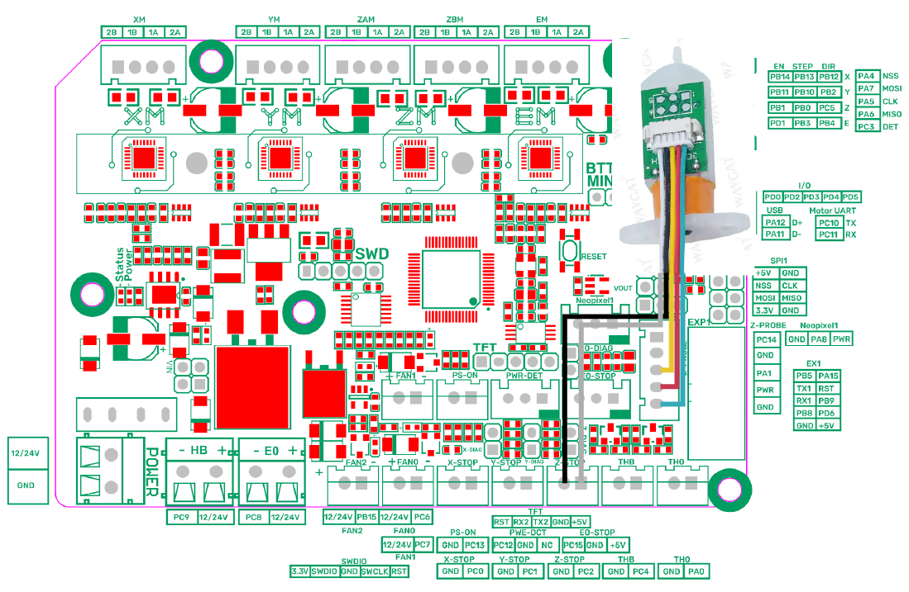

<h1 align="center">Marlin 3D Printer Firmware</h1>

    
    
    
    
    
     
    

Additional documentation can be found at the [Marlin Home Page](https://marlinfw.org/).
Please test this firmware and let us know if it misbehaves in any way. Volunteers are standing by!

### Configuration For Custom Ender 3
It is build for https://www.thingiverse.com/thing:3856703
Direct Drive - BMG + E3D V6 + BLTOUCH + SKR MINI E3 V3
&nbsp;
- #define NOZZLE_TO_PROBE_OFFSET { 32, -2, 0 } // tell how far is bltouch from the nozzle

## Features

## BL touch 
- For correct functioning you should plug 3D touch/BL touch as this diagram. It can work with connecting everything in Z-Probe pins, but I haven't test it yet. It works for now.

  

## configuration.h changes
There are some speed changes that i won't write here
- #define USE_PROBE_FOR_Z_HOMING
- #define BLTOUCH
- #define Z_PROBE_SERVO_NR 0
- #define NOZZLE_TO_PROBE_OFFSET { 32, -2, 0 } // 
- #define PROBING_MARGIN 25 // the bigger number the further away from the edges
- #define Y_MIN_POS -5

&nbsp;
Bl touch work as servo, so for a lot of people it doesn't work becouse they don't have this information.

- #define NUM_SERVOS 1 //
- #define SERVO_DELAY { 300 }

&nbsp;
- #define AUTO_BED_LEVELING_BILINEAR
- #define RESTORE_LEVELING_AFTER_G28
- #define LCD_BED_LEVELING
- #define LCD_BED_TRAMMING // it moves nozzle above the springs so you can make bed really flat

&nbsp;
- #define Z_SAFE_HOMING
- #define NOZZLE_PARK_FEATURE // pause function won't stop at the 3d print, but away from it

&nbsp;
- #define PRINTCOUNTER // why not
- #define FAN_SOFT_PWM
- #define FAN_SOFT_PWM

## Marlin 2.1 Bugfix Branch

__Not for production use. Use with caution!__

Marlin 2.1 takes this popular RepRap firmware to the next level by adding support for much faster 32-bit and ARM-based boards while improving support for 8-bit AVR boards. Read about Marlin's decision to use a "Hardware Abstraction Layer" below.

This branch is for patches to the latest 2.1.x release version. Periodically this branch will form the basis for the next minor 2.1.x release.

Download earlier versions of Marlin on the [Releases page](https://github.com/MarlinFirmware/Marlin/releases).

## Building Marlin 2.1

To build and upload Marlin you will use one of these tools:

- The free [Visual Studio Code](https://code.visualstudio.com/download) using the [Auto Build Marlin](https://marlinfw.org/docs/basics/auto_build_marlin.html) extension.
- The free [Arduino IDE](https://www.arduino.cc/en/main/software) : See [Building Marlin with Arduino](https://marlinfw.org/docs/basics/install_arduino.html)
- You can also use VSCode with devcontainer : See [Installing Marlin (VSCode devcontainer)](http://marlinfw.org/docs/basics/install_devcontainer_vscode.html).

Marlin is optimized to build with the **PlatformIO IDE** extension for **Visual Studio Code**. You can still build Marlin with **Arduino IDE**, and we hope to improve the Arduino build experience, but at this time PlatformIO is the better choice.

## Marlin Support

The Issue Queue is reserved for Bug Reports and Feature Requests. To get help with configuration and troubleshooting, please use the following resources:

- [Marlin Documentation](https://marlinfw.org) - Official Marlin documentation
- [Marlin Discord](https://discord.gg/n5NJ59y) - Discuss issues with Marlin users and developers
- Facebook Group ["Marlin Firmware"](https://www.facebook.com/groups/1049718498464482/)
- RepRap.org [Marlin Forum](https://forums.reprap.org/list.php?415)
- Facebook Group ["Marlin Firmware for 3D Printers"](https://www.facebook.com/groups/3Dtechtalk/)
- [Marlin Configuration](https://www.youtube.com/results?search_query=marlin+configuration) on YouTube

## Contributors

Marlin is constantly improving thanks to a huge number of contributors from all over the world bringing their specialties and talents. Huge thanks are due to [all the contributors](https://github.com/MarlinFirmware/Marlin/graphs/contributors) who regularly patch up bugs, help direct traffic, and basically keep Marlin from falling apart. Marlin's continued existence would not be possible without them.

## License

Marlin is published under the [GPL license](/LICENSE) because we believe in open development. The GPL comes with both rights and obligations. Whether you use Marlin firmware as the driver for your open or closed-source product, you must keep Marlin open, and you must provide your compatible Marlin source code to end users upon request. The most straightforward way to comply with the Marlin license is to make a fork of Marlin on Github, perform your modifications, and direct users to your modified fork.

While we can't prevent the use of this code in products (3D printers, CNC, etc.) that are closed source or crippled by a patent, we would prefer that you choose another firmware or, better yet, make your own.
